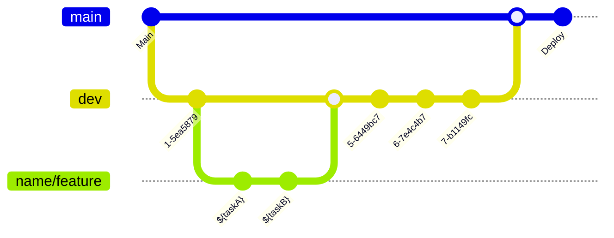

# BillBuddy

> 깔끔한 정산 시스템과 편리한 채팅 기능을 통해 친구와의 여행을 더 즐겁게 만들어 주는 빌버디
<br>

## 개발 환경
- 개발 기간
  - 기획 : 2023.9.19 ~ 2023.9.25
  - 개발 : 2023.9.26 ~ 2023.10.24
- 기술 스택
  - Swift 5, iOS 16.0, XCode 15.0
  - 라이브러리 : Firebase, TossPayments, Google AbMob
  - 협업 도구 : Github, Figma, Notion, Discord
  - 다크모드 미지원, 가로모드 미지원 
<br>

## 주요 기능
- **`홈(여행목록)`** 정산 중인 여행과 정산 완료된 여행 목록을 확인하고 새로운 여행을 생성할 수 있습니다.
- **`여행 디테일`** 지출 내역을 추가할 수 있고 인원/일자/전체 정산 내역과 지도를 통한 지출 장소를 확인할 수 있습니다.
- **`채팅`** 여행 참여 멤버들과 채팅할 수 있고 채팅을 통해 주고받은 사진을 한 번에 모아 확인할 수 있습니다.
- **`구독 결제`** 토스 페이먼츠 결제를 통해 광고를 제거해 주는 프리미엄 멤버십을 구독할 수 있습니다.
- **`푸시 알림(초대)`** 푸시 알림을 통해 딥링크롤 전송하여 친구를 초대할 수 있고, 지출내역 변동과 새로운 채팅 메시지 알림을 발송합니다.
<br>

## Architevture
Model이 있고 해당 Model의 로직을 처리하는 Service, Store 그리고 View가 있는 MV 구조를 하고 있지만 필요할 경우 View Model의 역할을 해야 하는 상황도 존재하기에 MVVM 구조라고 생각할 수도 있을 것 같습니다.
<br>
<br>

## Folder Structure
```
📦BillBuddy
 ┣ 🗂Common
 ┣ 🗂Config
 ┣ 🗂Extension
 ┣ 🗂Model
 ┣ 🗂Resource
 ┃ ┣ 🗂Assets.xcassets
 ┃ ┗ 🗂font
 ┣ 🗂Scene
 ┃ ┣ 🗂Admob
 ┃ ┃ ┗ 🗂View
 ┃ ┣ 🗂App
 ┃ ┣ 🗂Chatting
 ┃ ┃ ┣ 🗂Model
 ┃ ┃ ┣ 🗂Store
 ┃ ┃ ┗ 🗂Views
 ┃ ┣ 🗂Content
 ┃ ┣ 🗂DeepLink
 ┃ ┣ 🗂Detail
 ┃ ┃ ┣ 🗂Store
 ┃ ┃ ┗ 🗂Views
 ┃ ┣ 🗂Map
 ┃ ┣ 🗂Membership
 ┃ ┃ ┣ 🗂Notification
 ┃ ┃ ┣ 🗂Store
 ┃ ┃ ┗ 🗂Views
 ┃ ┣ 🗂MyPage
 ┃ ┃ ┣ 🗂Store
 ┃ ┃ ┗ 🗂Views
 ┃ ┣ 🗂Sign
 ┃ ┃ ┣ 🗂Model
 ┃ ┃ ┣ 🗂Store
 ┃ ┃ ┗ 🗂Views
 ┃ ┗ 🗂TravelList
 ┃ ┃ ┣ 🗂Model
 ┃ ┃ ┣ 🗂Store
 ┃ ┃ ┗ 🗂Views
 ┗ 📜Service
```

## Git Flow


## Team 돈독
| 윤지호 | 김상인 | 김유진 | 노유리 |
|:---:|:---:|:---:|:---:|
|  |  |  |  |
| [@yoonjiho37](https://github.com/yoonjiho37) | [@sikim4991](https://github.com/sikim4991) | [@usingkim](https://github.com/usingkim) | [@yforyuri](https://github.com/yforyuri) |
| PM, 딥링크, 결산 | 광고, 구독결제 | 여행 디테일 | 채팅 |

| 박지현 | 이승준 | 한아리 | 황지연 |
|:---:|:---:|:---:|:---:|
|  |  |  |  |
| [@wowhyunnie](https://github.com/wowhyunnie) | [@seungzunlee](https://github.com/seungzunlee) | [@ariirang](https://github.com/ariirang) | [@growlamb](https://github.com/growlamb) |
| 회원가입, 로그인, 마이페이지 | 지도 | 여행 리스트 | 푸시 알림 |

